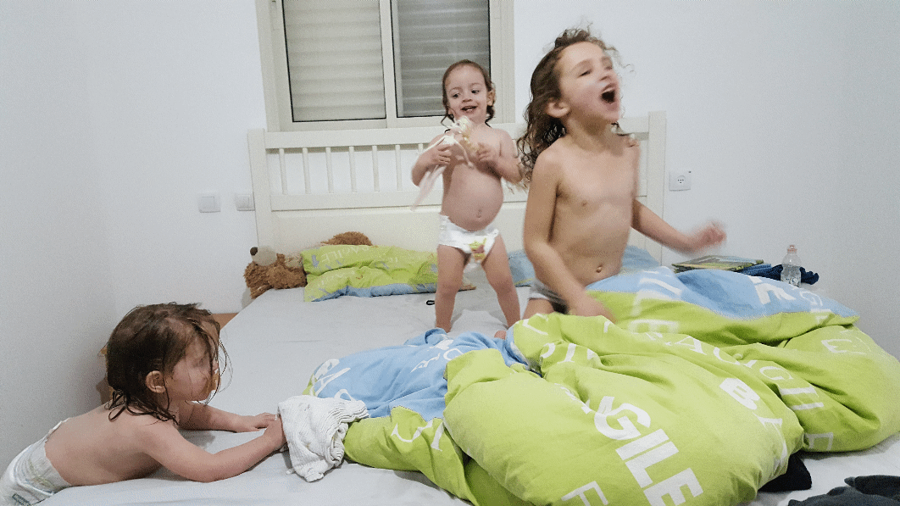

Five packages in five weeks - from boredom to contribution via blogging
========================================================
author: Giora Simchoni, IBM Research
date: February 3rd, 2018
autosize: true

rstudio::conf 2018

This RPres/html is available at Github:
https://github.com/gsimchoni/rstudio_conf_2018

Bored
========================================================
title: FALSE
type: black_center

# <center>I was bored.</center>

Jog
========================================================
title: FALSE
type: black_image
# <center>And I couldn't jog.</center>
<center><center>

Blog
========================================================
title: FALSE
type: black_center

# <center>Thought I'd start a R blog.</center>

Witnesses
========================================================
title: FALSE
type: black_center

# <center>"This time there would be no witnesses."</center>
## Douglas Adams

I've stopped being ashamed for not being into...
========================================================

- Air Quality
- Stock Market Analysis
- DNA Microarrays
- Mapping Bicycle Routes
- Asteroid Density Estimation
- Bayesian Generalized Linear Mixed Effects Modeling of Tuberculosis
- Sparse Cannonical Correlation Analysis for High Throughput Textual Data from Reuters

I'm more interested in...
========================================================

- Beyonce
- Ballet Dancing Statistics
- Predicting America's Next Top Model Winner
- Survivor Cast Survival Analysis
- Disproving Astrological Theories
- Recurrent Neural Networks for Rap Lyrics Production
- Estimating the Winner in a 1976 Nadia Comaneci vs. 2016 Simone Biles battle
- Beyonce

Word
========================================================
title: FALSE
type: black_center

# <center>I have one word for you.</center>

Blogdown
========================================================
title: FALSE
type: black_image
# <center>blogdown.</center>
<center></center>

So I had been blogging...
========================================================


<small>[Anne Frank's Diary: A Sentiment Analysis](http://giorasimchoni.com/2017/04/25/2017-04-25-anne-frank-s-diary-a-sentiment-analysis/)</small>

And blogging...
========================================================


<small>[You Better (Net)Work!](http://giorasimchoni.com/2017/04/27/2017-04-27-you-better-net-work-netweork-analysis-of-rupaul-s-drag-race-contestants/)</small>

And blogging...
========================================================


<small>[Ave Mariah](http://giorasimchoni.com/2017/12/10/2017-12-10-ave-mariah/)</small>

And blogging...
========================================================


<small>[Read My Face (Drawing Portraits with Text)](http://giorasimchoni.com/2017/07/09/2017-07-09-read-my-face/)</small>

Yu's Tweet
========================================================
title: FALSE
type: black_image
# <center>When suddenly!</center>
<center></center>

I don't do packages
========================================================

- Packages are hard
- Who would want to download my package and run it?
- My code isn't at a level where it can be packaged and distributed
- I'm more of a one-time script kinda girl, moment to moment...
- I hate writing documentation and tests
- CRAN would hate me (a.k.a CRANophobia)
<center></center>

Then came YRBSS
========================================================
title: FALSE
type: black_center

# <center>But then came YRBSS.</center>

The American CDC Youth Risk Behavior Surveillance System (YRBSS)
========================================================

- [Gold mine](https://www.cdc.gov/healthyyouth/data/yrbs/index.htm)
- ~170 multiple-choice questions regarding risk behavior of youth (9th to 12th grade)
- Asked in huge surveys conducted at the national and state level, every 2 years, from 1991 to 2015.
- "During the past 30 days, how many times did you use any form of cocaine, including powder, crack, or freebase?"

YRBSS (II)
========================================================

But:
- API is too inconvenient and slow for any real research
- The barcharts are ugly
- Can only download the ("Combined") data as a "ASCII" raw .dat file or as a MS Access (?!) file
- The raw "ASCII" data file, however, has no column labels, and to get those you need to run a script you can download either in SAS or SPSS

YRBSS (III)
========================================================

So:
- Download the MS Access driver
- Download the MS Access zipped file, unzip
- Install the `survey` package
- RTFM (80 pages long PDF)
- And to get a simple answer to a simple question: how many of US youth are currently sexually active...
<small>

```r
library(survey)

yrbss_data_binary <- svydesign(id = ~PSU, weight = ~weight, strata = ~stratum, data = yrbss_data_binary, nest = TRUE)

svyciprop(~I(qn63 == 1), subset(yrbss_data_binary, year == 2015), na.rm=TRUE)
```
</small>

No One
========================================================
title: FALSE
type: black_center

# <center>No one should go through the pain I went through.</center>

My Package Bookmarks (in this order)
========================================================

- Hilary Parker: [Writing an R package from scratch](https://hilaryparker.com/2014/04/29/writing-an-r-package-from-scratch/) | ~5 min
- Karl Broman: [R package primer](http://kbroman.org/pkg_primer/) | ~1 hour
- Hadley Wickham: [R packages](http://r-pkgs.had.co.nz/) | ~A few days
- Stack Overflow: [Stack Overflow](https://stackoverflow.com/) | ~Lifetime

Twenty Minutes
========================================================
title: FALSE
type: black_image

# <center>20 minutes later...</center>
# <center></center>

And you can just...
========================================================
<small>

```r
devtools::install_github("gsimchoni/yrbss")

library(yrbss)

getProportionSingleVariable(.variable = "qn63", .location = "US", .year = 2015)
```


```
$prop
[1] 0.3009435

$ciLB
[1] 0.2728081

$ciUB
[1] 0.3306611

$n
[1] 13910
```
</small>

The yrbss Package
========================================================


```r
library(tidyverse)

tibble(.variable = rep("qn65", 26),
       .location = rep("US", 26),
       .year = rep(seq(1991, 2015, 2), 2),
       .filters = rep(c("sex == 1", "sex == 2"),
                      each = 13)) %>%
  bind_cols(
    pmap_df(., getProportionSingleVariable)) %>%
  ggplot(aes(.year, prop, color = .filters)) +
  geom_line() +
  scale_color_manual(
    labels = c("Female", "Male"),
    values = c("red", "blue")) +
  labs(title = paste("YRBSS: Proportion of Male",
                     "and Female US Youth",
                     "Reporting Use of Condom"),
       x = "Survey Year",
       y = "Proportion Reporting Use of Condom",
       color = "Gender")
```

The yrbss Package
========================================================


No Stopping
========================================================
title: FALSE
type: black_center

# <center>There was no stopping me after this.</center>

The kandinsky Package
========================================================
<center>

```r
library(kandinsky)

kandinsky(iris)
```


</center>

The mocap Package
========================================================
<center>

```r
library(mocap)

#...

makeMotionMovie(asf, amc, xyz, skipNFrames = 4)
```


</center>

The CastleOfR Package
========================================================
<center>

```r
library(CastleOfR)

startGame()
```


</center>

The songsim Package
========================================================
<center>

```r
library(songsim)

path <- system.file("extdata", "formation.txt",
                    package = "songsim")
songsim(path, colorfulMode = TRUE,
        mainTitle = "Formation - Beyonce")
```


</center>

The ssdkeras Package
========================================================
<center>

```r
library(ssdkeras)

# it's complicated...
```


</center>

The ebayr Package
========================================================
<center>

```r
library(ebayr)

setEbayToken("YOUR_EBAY_TOKEN")
search_ebay("elvis costume")
```

</center>

The ggwithimages Package
========================================================


```r
library(ggwithimages)

#...

ggplot(kathmandu_hourly_aqi, aes(hour, aqi)) +
  geom_line_with_image(annapurna, sky) +
  labs(title = paste("Air Quality Index in the",
                     "Thamel, Kathmandu, Nepal"),
       subtitle = paste("Measured in PM2.5",
                        "by the US Embassy",
                        "in Kathmandu"),
       y = "Hourly Mean AQI [PM2.5]",
       x = "Hour") +
  ylim(c(50, 200)) +
  theme(text = element_text(family="mono"),
        axis.title.x = element_text(size=12),
        axis.title.y = element_text(size=12))
```

The ggwithimages Package
========================================================


More like 10 packages in 6 months...
========================================================


What's in it for me
========================================================
title: FALSE
type: black_center

# <center>What's in it for me.</center>

"My world has changed, and so have I."
========================================================

- Portfolio
- Exercise & Learning
- Fun
- Fame
- People using your code, appreciating it, improving it (PR)
- Sense of community
- Job offers & Other opportunities
- Even improved my own job

<center></center>

"Dry land is not a myth."
========================================================


Your R Country Needs You!
========================================================


***

Blog: http://giorasimchoni.com/

Github: https://github.com/gsimchoni

Twitter: https://twitter.com/GioraSimchoni

LinkedIn: https://www.linkedin.com/in/gsimchoni/

Thanks.
